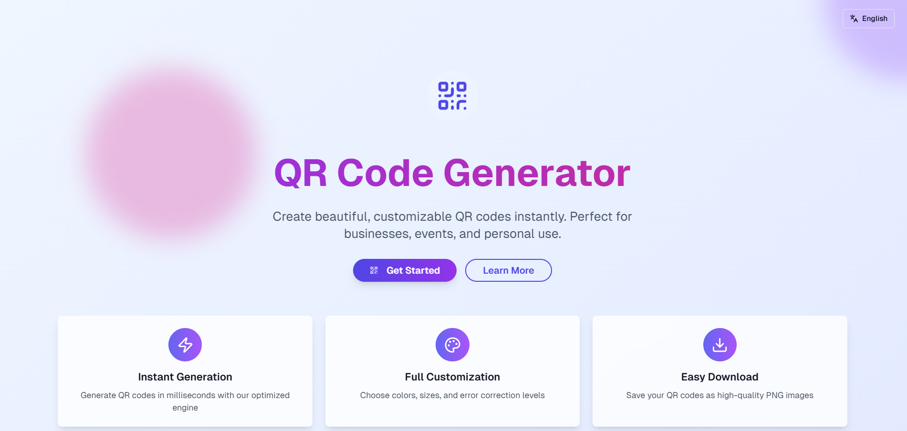
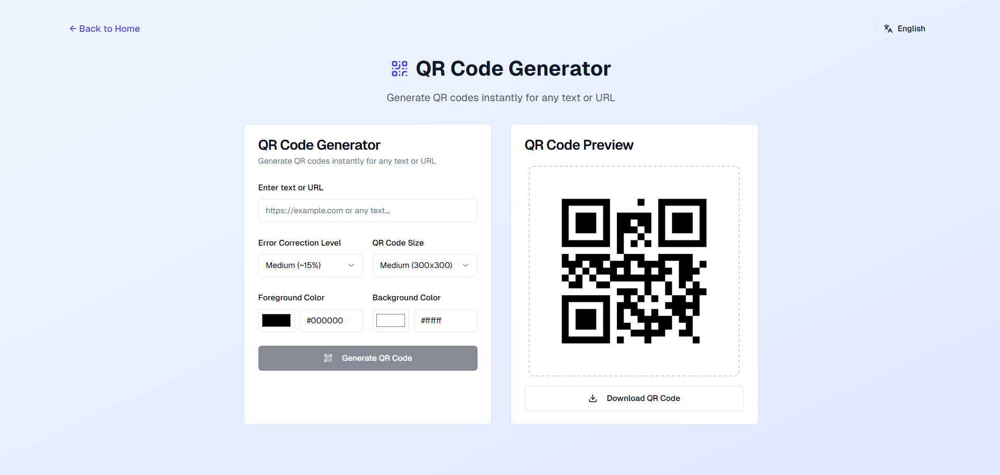

<h1 align="center">
  
</h1>

<p align="center">
  
  
</p>

<p align="center">A modern, responsive QR code generator built with Next.js and React. Generate QR codes instantly with customizable options and multi-language support.</p>

<p align="center">
  
  
</p>

## 🔺 Demo

### [Live Demo, click here](https://qr-code-generator.vercel.app/)

## 📦 Tech Stack

- Framework: Next.js 14 with App Router
- UI Components: shadcn/ui
- Styling: Tailwind CSS
- QR Generation: qrcode library
- Icons: Lucide React

[check in package.json](/package.json)

## ⚙️ Features

- Instant generation
- Full customization
- Easy download
- Multi-language
- Safe and private

## 📂 Structure

```
  src/
  ├── app/
  │   ├── globals.css
  │   ├── layout.tsx
  │   └── page.tsx
  ├── components/
  │   ├── ui/                    # shadcn/ui components
  │   ├── language-provider.tsx
  │   ├── language-selector.tsx
  │   └── qr-code-generator.tsx
  └── lib/
      └── utils.ts
```

## 🔩 Installation

To install and run the project locally, follow these steps:

1. Install [**Yarn**](https://yarnpkg.com/) on your computer
1. Clone the repository `git clone https://github.com/jhonbergmann/qr-code-generator`
1. Navigate to the project directory: `cd qr-code-generator`
1. Install the dependencies: `yarn install`

## ⚙️ Usage

1. Start the development server: `yarn dev`
1. Now access the following url in your browser: `http://localhost:3000`

## 📝 License

[MIT © Jhonatan Bergmann](https://github.com/jhonbergmann/qr-code-generator/blob/main/LICENSE)
